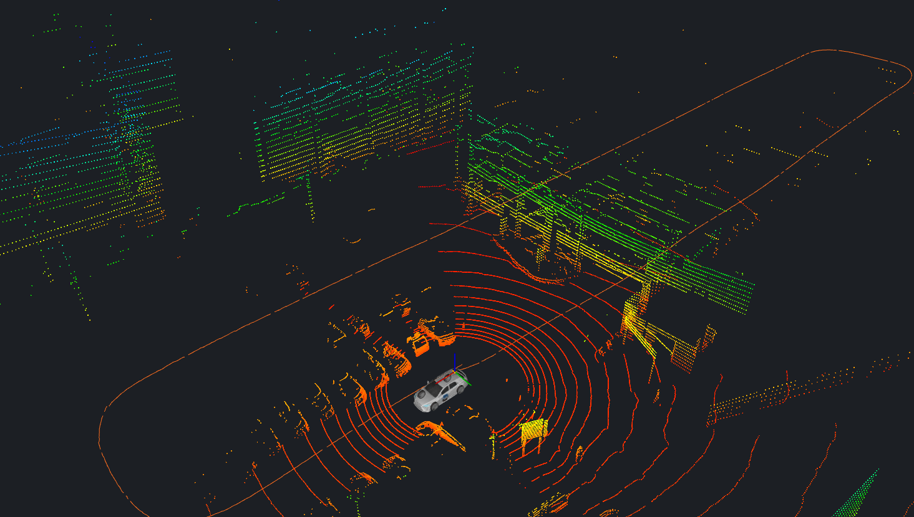
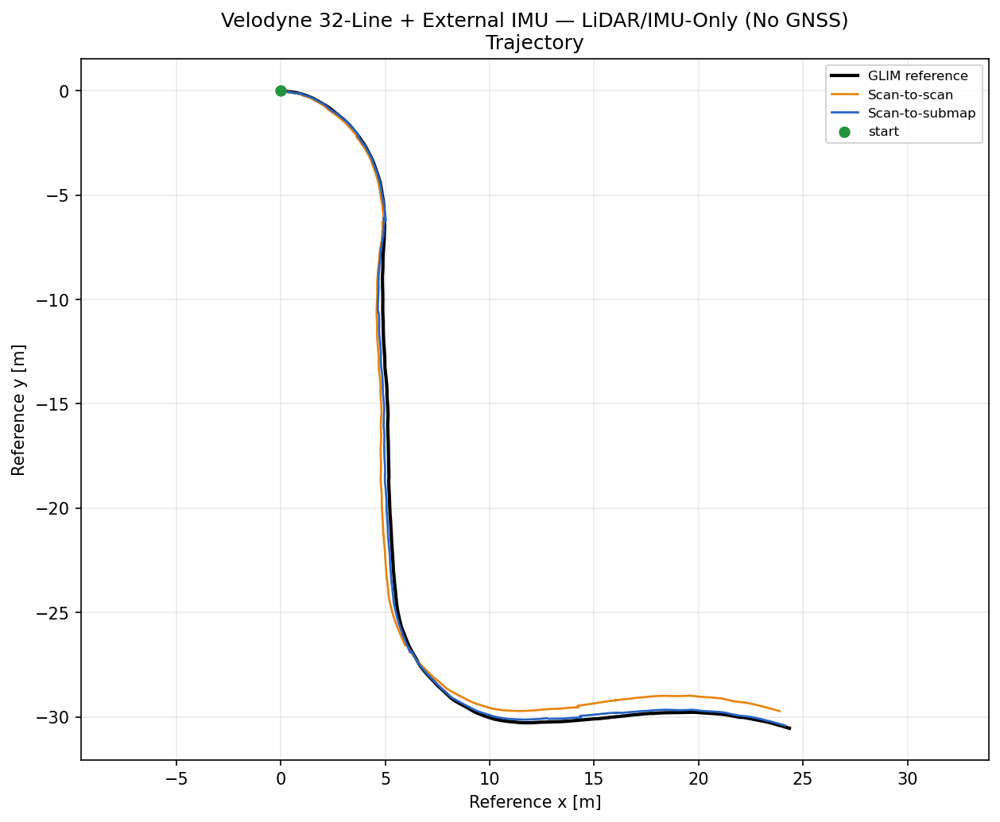
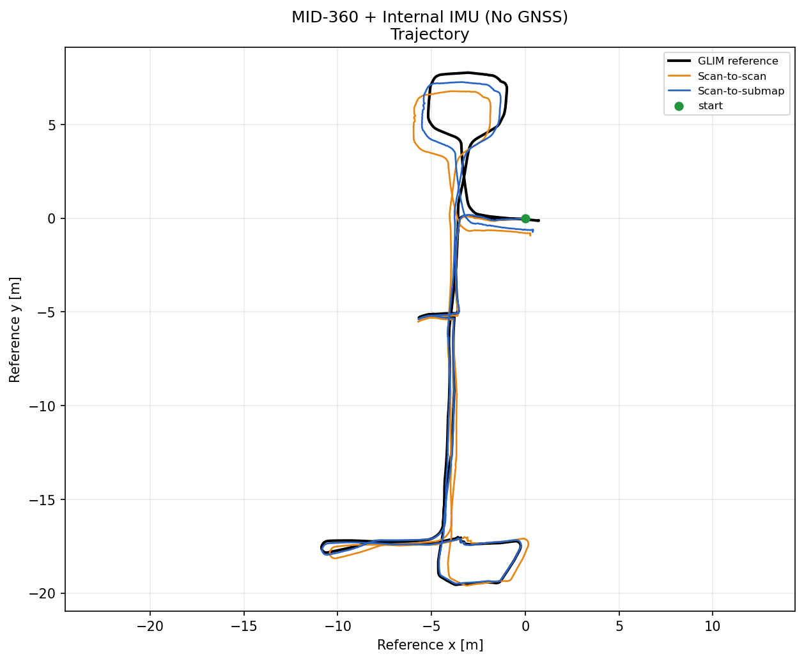
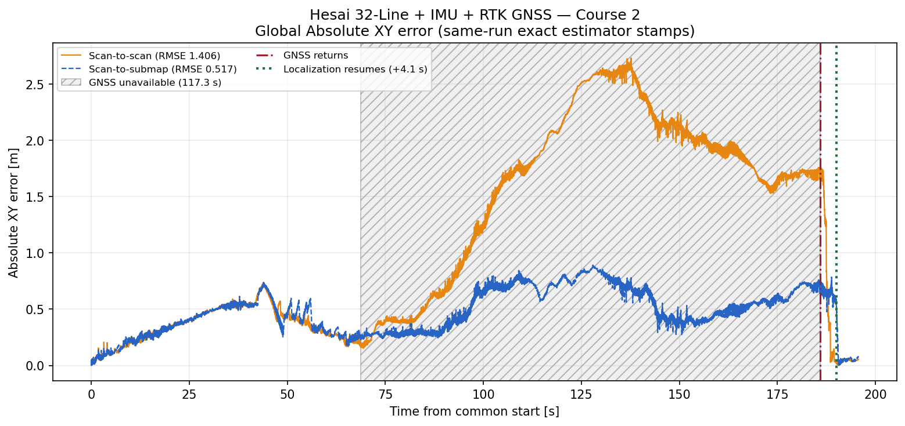
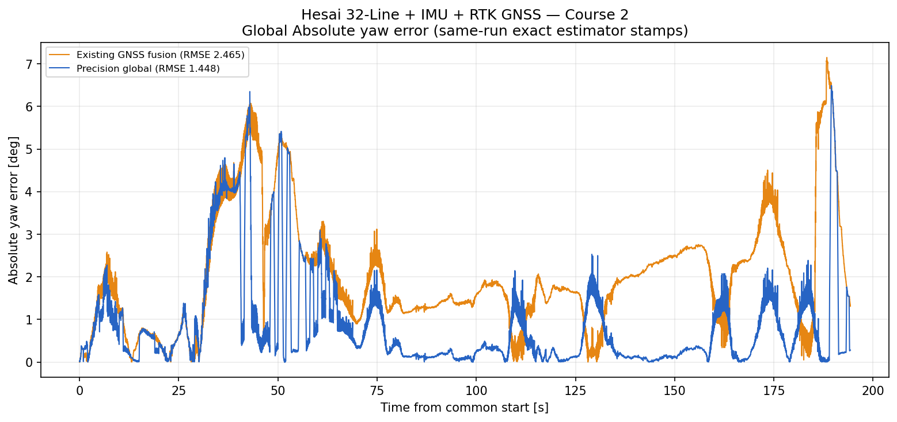
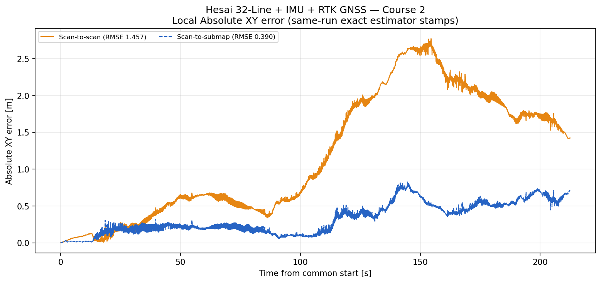
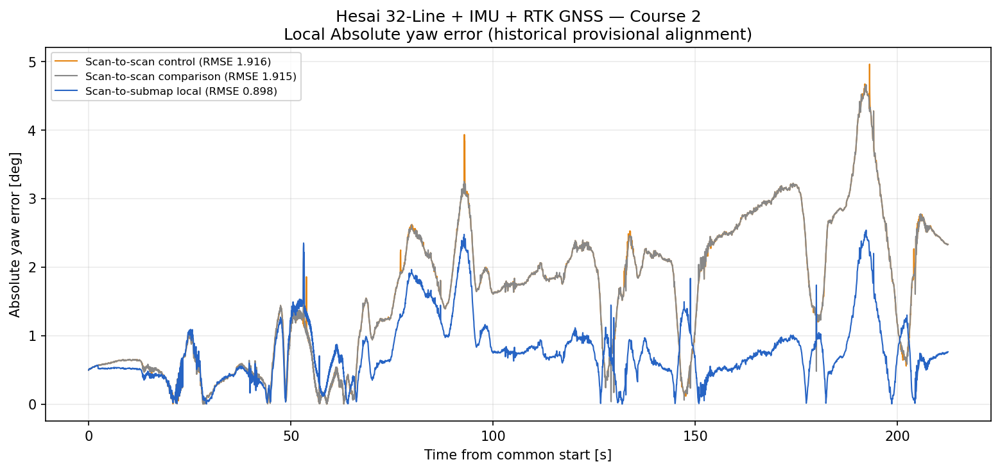

# GICP–GNSS Odom Localizer

<p align="center">
  <a href="docs/evaluation/assets/autoware_lsim_hesai_course_2/rviz_replay.webm"></a>
</p>

`gicp_gnss_odom_localizer` is a ROS 2 planar LiDAR–IMU–GNSS localization stack
for research and engineering evaluation. It provides LiDAR/IMU local odometry,
optional GNSS-based global localization, and an isolated scan-to-submap output
through standard ROS 2 messages and TF. Autoware support is an optional
downstream localization-interface adapter, not a core dependency.

The stack is prior-map-free: **it does not require a PCD map. Its
standard profiles also do not require wheel speed or a CUDA-capable GPU**.

## Intended uses and key capabilities

- **Robot odometry:** estimate local `x`, `y`, and yaw from LiDAR and IMU only.
- **Global vehicle or robot localization:** anchor LiDAR/IMU odometry with NMEA
  GGA/RTK GNSS while applying the calibrated antenna lever arm.
- **No required PCD map or wheel speed:** it does not require a PCD map. Its
  standard profiles also do not require wheel speed or a CUDA-capable GPU.
- **Optional scan-to-submap output:** run rolling-submap matching in isolated
  processes without feeding corrections into the scan-to-scan odometer.
- **General ROS 2 integration:** consume the odometry topics and TF directly in
  a robot, navigation, mapping, or automated-driving stack.
- **Optional Autoware example:** use the separate adapter to translate the same
  estimator outputs into Autoware pose, kinematic-state, acceleration, and TF
  interfaces. The core estimators do not depend on Autoware.
- **CPU-only operation:** the estimator has no CUDA dependency; CPU-only
  operation has also been demonstrated.

### Operating modes

| Mode | Processing path | Intended trade-off |
|---|---|---|
| **Scan-to-scan** | Strict deskew, scan-to-scan GICP, and the SE(2) smoother | Default path with fewer processes; publishes `/localization/gyro_lidar_odom` and can optionally feed GNSS fusion. CPU and RSS are not yet quantified. |
| **Scan-to-submap** | Keeps the scan-to-scan path unchanged and adds accepted-scan snapshots, an external rolling-submap matcher, and isolated local/global compositors | Adds computation and latency for separate scan-to-submap outputs at `/localization/precision_local_odom` and, with a healthy global anchor, `/localization/precision_global_odom`. |

The scan-to-submap mode runs alongside the primary scan-to-scan odometer. Its
corrections never feed back into scan-to-scan, and the mode is selected at
launch rather than switched while running.

The estimator is planar SE(2), intended for research and engineering
evaluation, and is not a safety-certified localization system. CPU utilization
and RSS have not yet been measured; CPU-only support is not a claim of low CPU
load.

## Evaluation results

The evaluation uses [GLIM](https://github.com/koide3/glim) as a correlated
LiDAR/IMU pseudo-reference; it is not independent ground truth. The RMSE values
compare the estimator output with that pseudo-reference. Representative results
are summarized below.

The published Hesai primary accuracy result uses exact-initial-pose alignment. Its
separate startup yaw-safety check uses a fixed legacy-global/GLIM calibration
window and does not contribute to the primary RMSE values or plots.

| Sensor configuration | Demonstrated result | Evaluation target |
|---|---|---|
| Velodyne 32-Line + External IMU — LiDAR/IMU-Only (No GNSS) | On the valid 45.991 s prefix, scan-to-submap reduced XY/yaw RMSE from **0.4946 m / 0.3140 deg** to **0.2156 m / 0.1227 deg** | LiDAR/IMU-only local odometry |
| Livox MID-360 + Internal IMU — LiDAR/IMU-Only (No GNSS) | Tuned rolling scan-to-submap reduced XY/yaw RMSE from **0.6303 m / 2.9064 deg** to **0.2941 m / 0.6024 deg** over 294.099 s | LiDAR/IMU-only local odometry |
| Hesai 32-Line + IMU + RTK GNSS — Course 2 | Scan-to-submap global XY/yaw RMSE improved over scan-to-scan from **1.7105 m / 2.4647 deg** to **0.5060 m / 1.4484 deg**; GNSS-outage yaw RMSE improved from **2.0770 deg** to **0.7077 deg** | LiDAR/IMU/GNSS local and global localization |
| Example integration: Autoware localization-interface test — Hesai Course 2 | Current default-projection 1.0x headless replay produced **99.113 Hz** effective state output and **99.5316%** registration acceptance | Autoware localization-interface integration |

Additional private recordings are used for internal regression testing. Their
identities, measurements, and artifacts are intentionally not published.

### Representative plots

#### Velodyne 32-Line + External IMU

[](docs/evaluation/assets/velodyne_32line_external_imu/trajectory.png)

*Scan-to-scan and scan-to-submap over the accepted 45.991 s continuous prefix.*

**Assessment:** Scan-to-submap met the project's predefined accuracy criteria
on the accepted 45.991 s prefix, with **0.2156 m XY RMSE** and **0.1227 deg yaw
RMSE**.

#### Livox MID-360 + Internal IMU

[](docs/evaluation/assets/livox_mid360_internal_imu/trajectory.png)

*Tuned scan-to-scan and rolling scan-to-submap over the complete 294.099 s
evaluation interval.*

**Assessment:** Rolling scan-to-submap passed all predefined acceptance
criteria over the complete evaluated interval, with **0.2941 m XY RMSE** and
**0.6024 deg yaw RMSE**. This is sufficient for this recorded LiDAR/IMU-only
evaluation.

#### Hesai 32-Line + IMU + RTK GNSS

https://github.com/user-attachments/assets/6ce8b916-13e5-4779-87e9-c0f477a6e14b

[Open the repository-local Hesai Course 2 RViz replay (WebM)](docs/evaluation/assets/autoware_lsim_hesai_course_2/rviz_replay.webm)

The global plots compare the GNSS-anchored **scan-to-scan** and
**scan-to-submap** outputs.

| Hesai Course 2 global XY error | Hesai Course 2 global yaw error |
|---|---|
| [](docs/evaluation/assets/hesai_32line_imu_rtk_gnss_course_2/global_xy_error.png) | [](docs/evaluation/assets/hesai_32line_imu_rtk_gnss_course_2/global_yaw_error.png) |

*The hatched span marks 117.3 seconds without usable GNSS positioning. The red
marker shows GNSS returning; the green marker shows global localization
resuming 5.2 seconds later.*

**Assessment:** The scan-to-submap global output passed the Course 2 acceptance
criteria, with **0.5060 m XY RMSE** and **1.4484 deg yaw RMSE**. During the
evaluated GNSS outage it remained within the predefined limits, and global
localization resumed 5.2 seconds after usable GNSS positioning returned.

The local plots compare **scan-to-scan** with **scan-to-submap** odometry.

| Hesai Course 2 local XY error | Hesai Course 2 local yaw error |
|---|---|
| [](docs/evaluation/assets/hesai_32line_imu_rtk_gnss_course_2/local_xy_error.png) | [](docs/evaluation/assets/hesai_32line_imu_rtk_gnss_course_2/local_yaw_error.png) |

**Assessment:** The scan-to-submap local output met the Course 2 accuracy
criteria, with **0.4785 m XY RMSE** and **0.7390 deg yaw RMSE**.

These are dataset-scoped engineering acceptance results. They do not establish
fitness for safety-critical use or accuracy across other datasets,
environments, or sensor installations.

See the [evaluation pages](docs/evaluation/README.md) for full-size plots, error
distributions, methodology, provenance, and limitations.

## Required data

The normal LiDAR/IMU configuration requires:

- `sensor_msgs/msg/PointCloud2` with a valid per-point time field;
- monotonic `sensor_msgs/msg/Imu` samples covering each scan;
- calibrated static transforms from `base_link` to the LiDAR and IMU frames.

GNSS operation additionally requires NMEA GGA input, a projection configuration
that matches the deployment's map metadata, and a calibrated `base_link` to
GNSS-antenna transform. The packaged runtime parameters in
[`param/param.yaml`](src/pure_nmea_gnss_conversion/param/param.yaml) match the
projector type, datum, origin, and scale in
[`map_projector_info.yaml`](src/pure_nmea_gnss_conversion/config/map_projector_info.yaml).
The metadata file is not itself a ROS parameter file. Optional Doppler or
secondary-antenna topics can provide additional heading observations.

See [known limitations](docs/known_limitations.md) before selecting this stack
for a new sensor, environment, or vehicle.

## Public synthetic rosbag sample

The repository includes a 6.4 MiB
[fully procedural LiDAR/IMU rosbag](data/synthetic_output_pointcloud2/) for
trying the localization stack without a private sensor recording. It reproduces
only the PointCloud2 field layout and rounded LiDAR/IMU rates observed in the
private `output_pointcloud2` input. It contains no copied or transformed source
points, trajectory, GNSS, recording timestamp, calibration, or scene geometry.

The current regression run deskewed 121/121 scans without fallback, corrected
1,241/1,241 IMU samples, accepted 118/120 post-initialization registrations,
and ended within 0.0667 m / 0.359 deg of the analytic endpoint. These results
cover one artificial scene and are not a sensor benchmark or real-world
accuracy claim. Follow [Replay the public synthetic
rosbag](#replay-the-public-synthetic-rosbag) for the commands. See the
[dataset card](data/README.md) for provenance, schema, hashes, regeneration, and
limitations.

## Packages

The usual entry points are `pure_odometry_bringup` for scan-to-scan and
`pure_precision_bringup` for the optional scan-to-submap overlay. The remaining
packages are components and interfaces installed from the same repository.

| Package | Role |
|---|---|
| `pure_odometry_bringup` | Primary launch, configuration, and RViz entry point for the LiDAR–IMU–GNSS localization stack. |
| `pure_precision_bringup` | Launch and configuration entry point for the optional isolated scan-to-submap overlay. |
| `pure_autoware_localization_adapter` | Converts fused odometry into Autoware-facing kinematic-state, pose, acceleration, and `map -> base_link` interfaces. |
| `pure_imu_undistortion` | Validates point timing and deskews LiDAR scans from IMU motion, with optional translation compensation. |
| `pure_lidar_gyro_odometer` | Produces scan-to-scan planar LiDAR–IMU odometry with fixed-lag SE(2) smoothing. |
| `pure_nmea_gnss_conversion` | Converts NMEA GGA and optional heading observations into explicit GNSS fusion inputs. |
| `pure_gnss_map_odom_fusion` | Anchors local odometry in `map` using multi-sample GNSS initialization and bounded outage recovery. |
| `pure_lidar_submap_matcher` | Computes isolated rolling-submap SE(2) corrections from accepted LiDAR scans. |
| `pure_precision_global_localizer` | Composes scan-to-submap local output and guarded GNSS-anchored scan-to-submap global output without publishing TF. |
| `pure_gnss_msgs` | Defines the GNSS observation messages shared by the conversion and fusion packages. |
| `pure_lidar_msgs` | Defines the exact-key scan and correction messages used by the scan-to-submap branch. |

`small_gicp` is an external MIT-licensed dependency included as a Git submodule;
it is not a first-party package in this project.

## Validated environments

| Use case | Operating system | ROS 2 | Autoware | Status and scope |
|---|---|---|---|---|
| Standalone localization | Ubuntu 24.04 | Jazzy | Not required | Primary source-build and rosbag-replay target. |
| Optional Autoware integration | Ubuntu 24.04 | Jazzy | 1.9.0 | Localization-interface-only replay validated in the supplied CPU-only Docker workflow. |
| Other combinations | — | — | — | Not currently claimed; they may work but have not been validated by this project. |

The standalone estimator path does not require Autoware. The Autoware 1.9.0
result covers localization-facing topics, TF, simulation time, and GNSS-outage
recovery only. It does not establish full-stack integration, closed-loop driving,
planning/control readiness, or safety certification. CPU-only execution was
demonstrated, but CPU utilization and memory usage were not measured.

## Build

ROS 2 Jazzy on Ubuntu 24.04 is the primary target.

```bash
git clone --recurse-submodules \
  https://github.com/KariControl/gicp_gnss_odom_localizer.git
cd gicp_gnss_odom_localizer

source /opt/ros/jazzy/setup.bash
rosdep install --from-paths src --ignore-src -r -y
colcon build --symlink-install --cmake-args -DCMAKE_BUILD_TYPE=Release
source install/setup.bash
```

## Quick start

Every terminal must source ROS 2 and `install/setup.bash`. Publish the calibrated
sensor static transforms before expecting accepted localization output.

### Scan-to-scan mode: LiDAR + IMU local odometry

```bash
ros2 launch pure_odometry_bringup odometry_container.launch.py \
  use_gnss:=false \
  points_input_topic:=/points_raw \
  imu_input_topic:=/imu
```

The primary output is `/localization/gyro_lidar_odom` in the `odom` frame.

For rosbag replay, start the estimator with simulated time:

```bash
ros2 launch pure_odometry_bringup odometry_container.launch.py \
  use_sim_time:=true \
  use_gnss:=false \
  points_input_topic:=/points_raw \
  imu_input_topic:=/imu
```

Then use the replay helper in a second sourced terminal:

```bash
BAG_DIR=/path/to/recording
POINTS_TOPIC=/recorded/pointcloud
IMU_TOPIC=/recorded/imu

./script/play_localization_bag.sh \
  --bag "$BAG_DIR" --points "$POINTS_TOPIC" --imu "$IMU_TOPIC"
```

The helper isolates recorded dynamic localization TF by default while retaining
recorded static sensor transforms.

### Scan-to-submap mode: rolling-submap output

Keep the scan-to-scan odometer in `scan_to_scan`, enable only its accepted-scan
snapshot bridge, and start the overlay in another sourced terminal:

```bash
ros2 launch pure_odometry_bringup odometry_container.launch.py \
  use_gnss:=false \
  odom_override_param:=$(ros2 pkg prefix pure_precision_bringup)/share/pure_precision_bringup/config/submap_snapshot_override.yaml

ros2 launch pure_precision_bringup precision_overlay.launch.py
```

This adds `/localization/precision_local_odom`; it does not replace or feed back
into `/localization/gyro_lidar_odom`.

### LiDAR + IMU + GNSS global localization

When the packaged projection matches the deployment's map metadata, launch with
the calibrated GNSS static TF and no evaluation-origin override:

```bash
ros2 launch pure_odometry_bringup odometry_container.launch.py \
  use_gnss:=true
```

For a different map projection, create a deployment-owned ROS parameter override
whose projector, datum, origin, and scale match that map's projector metadata;
do not pass `map_projector_info.yaml` directly as a ROS parameter file.

The principal global output is `/localization/ekf_odom`, with the corresponding
`map -> odom` TF when TF publication is enabled. See
[NMEA observation semantics](docs/nmea_heading_and_covariance.md) and
[GNSS initialization and recovery](docs/gnss_recovery.md) before deployment.

### Optional integration example: Autoware localization-interface integration

Autoware is one possible downstream consumer, not a dependency of the
localization stack. The optional Docker workflow connects the standard fused
output to Autoware localization interfaces without requiring a host Autoware
workspace:

```bash
BAG_DIR=/path/to/recording

./script/run_autoware_lsim_docker.sh \
  --bag "$BAG_DIR" \
  --points /recorded/pointcloud \
  --imu /recorded/imu
```

See the [Docker guide](docker/autoware_lsim/README.md) for GNSS, sensor profiles,
RViz, and scan-to-submap options.

For the ROSBAG2/3 presentation view, add `--rviz --rviz-sample-vehicle`. It shows
the illustrative Autoware Lexus body, a generated line trajectory, live
pose/yaw/speed and interface/TF/rate/registration/GNSS status in a dedicated
RViz Displays entry, and a bounded XY-only covariance ellipse in the 3D view.
The current Hesai profile applies a visual-only `-1.66 m` mesh offset fitted to
the observed ground. The sample mesh is not evidence of the recorded vehicle
model or geometry, and the offset is not a sensor-height calibration.

### Replay the public synthetic rosbag

Complete the [build steps](#build) first. Then start the LiDAR/IMU estimator
from the repository root in terminal 1:

```bash
source /opt/ros/jazzy/setup.bash
source install/setup.bash

ros2 launch pure_odometry_bringup lidar_imu_only.launch.py \
  use_sim_time:=true \
  use_imu_deskew:=true \
  points_input_topic:=/points_raw \
  imu_input_topic:=/imu
```

Replay the included synthetic rosbag from terminal 2:

```bash
source /opt/ros/jazzy/setup.bash
source install/setup.bash

./script/play_localization_bag.sh \
  --bag data/synthetic_output_pointcloud2 \
  --points /pandar_points_ex \
  --imu /sensor/imu/data_raw \
  --clock-frequency 100 \
  --tf-policy isolate-dynamic \
  -- --disable-keyboard-controls \
  --topics /pandar_points_ex /sensor/imu/data_raw /tf_static
```

Keep `--tf-policy isolate-dynamic`; `isolate-all` removes the static sensor
transforms required by the fail-closed deskewer and odometer. The resulting
local odometry is published on `/localization/gyro_lidar_odom`.

## Sensor-to-output flow

```text
PointCloud2 ─┐
IMU ─────────┴─> strict deskew ─┐
IMU ────────────────────────────┴─> scan-to-scan GICP + SE(2) smoother
                                         ├─> local odometry
                                         │   /localization/gyro_lidar_odom
                                         └─> [optional rolling submap]
                                              └─> /localization/precision_local_odom

NMEA GNSS ─> GNSS observation ─────────────┐
local odometry ────────────────────────────┴─> map/odom fusion
                                                 ├─> /localization/ekf_odom + map->odom TF

scan-to-submap local + healthy global anchor ─> /localization/precision_global_odom

standard ROS 2 odometry/TF outputs
  ├─> any ROS 2 robot or automated-driving application
  └─> [optional Autoware adapter] ─> Autoware localization topics
```

The scan-to-submap branch publishes separate outputs and no TF. Full frame,
component, and failure-isolation details are in
[Architecture](docs/architecture.md).

## Validation

```bash
python3 tools/check_repository.py
./tools/run_reference_tests.sh
colcon test --event-handlers console_direct+
colcon test-result --verbose
```

See [validation scope](docs/validation.md) for the full release and recording
gates.

## Documentation

- [Evaluation results and published plots](docs/evaluation/README.md)
- [Architecture](docs/architecture.md)
- [LiDAR/IMU odometry and scan-to-submap isolation](docs/lidar_odometry.md)
- [NMEA position, covariance, and heading](docs/nmea_heading_and_covariance.md)
- [GNSS initialization and outage recovery](docs/gnss_recovery.md)
- [Tuning](docs/tuning.md) and [known limitations](docs/known_limitations.md)
- [Rosbag and Autoware LSim workflow](docs/rosbag_and_autoware_lsim_evaluation.md)
- [Changelog and migration notes](CHANGELOG.md#unreleased)

## Citation and related work

Machine-readable citation metadata is provided in [`CITATION.cff`](CITATION.cff).
The registration path builds on
[Generalized-ICP (Segal et al., 2009)](https://doi.org/10.15607/RSS.2009.V.021)
through
[`small_gicp` (Koide, 2024)](https://doi.org/10.21105/joss.06948).
Published trajectory evaluation uses
[GLIM (Koide et al., 2024)](https://doi.org/10.1016/j.robot.2024.104750)
only as a correlated LiDAR/IMU pseudo-reference.

[LIO-SAM (Shan et al., 2020)](https://doi.org/10.1109/IROS45743.2020.9341176)
and
[FAST-LIO2 (Xu et al., 2022)](https://doi.org/10.1109/TRO.2022.3141876)
are representative tightly coupled LiDAR-inertial systems included as related
architectural context. They have not been evaluated as head-to-head baselines
in this repository.

See [CONTRIBUTING.md](CONTRIBUTING.md) and [SECURITY.md](SECURITY.md). Licensed
under Apache-2.0. Third-party attribution is in
[THIRD_PARTY_NOTICES.md](THIRD_PARTY_NOTICES.md).
