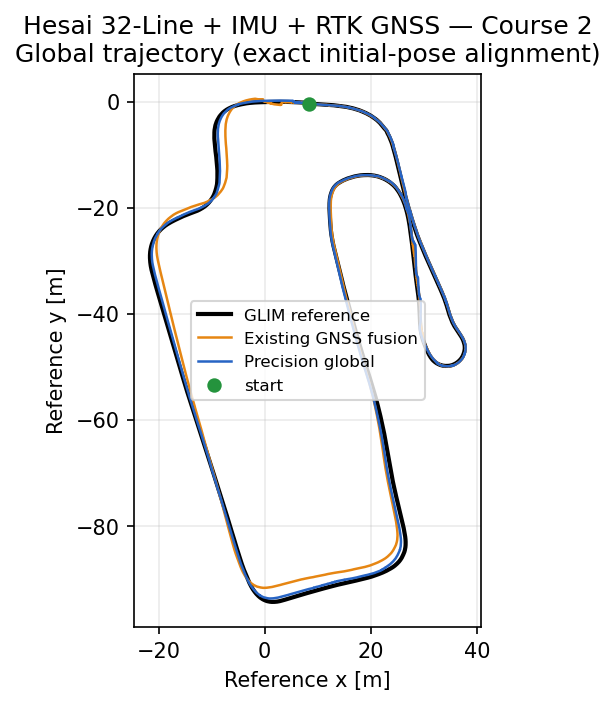

# GICP–GNSS Odom Localizer

`gicp_gnss_odom_localizer` is a general-purpose ROS 2 planar localization stack
for mobile robots and road vehicles. It provides LiDAR/IMU local odometry,
optional GNSS-based global localization, and an isolated rolling-submap
precision output through standard ROS 2 messages and TF.

The stack is prior-map-free: it does not require a PCD or Lanelet2 map. Its
standard profiles also do not require wheel speed or a CUDA-capable GPU.

## Intended uses and key capabilities

- **Robot odometry:** estimate local `x`, `y`, and yaw from LiDAR and IMU only.
- **Global vehicle or robot localization:** anchor LiDAR/IMU odometry with NMEA
  GGA/RTK GNSS while applying the calibrated antenna lever arm.
- **GNSS outage handling:** continue on LiDAR/IMU during an outage, then return
  through guarded multi-sample alignment and bounded correction.
- **Optional precision output:** run rolling-submap matching in isolated
  processes without feeding corrections into the baseline odometer.
- **General ROS 2 integration:** consume the odometry topics and TF directly in
  a robot, navigation, mapping, or automated-driving stack.
- **Optional Autoware example:** use the separate adapter to translate the same
  estimator outputs into Autoware pose, kinematic-state, acceleration, and TF
  interfaces. The core estimators do not depend on Autoware.
- **CPU-only operation:** the estimator has no CUDA dependency; CPU-only
  operation has also been demonstrated.

### Operating modes

| Mode | Processing path | Intended trade-off |
|---|---|---|
| **Computation-speed priority (`normal mode`)** | Strict deskew, scan-to-scan GICP, and the SE(2) smoother | Default mode with fewer processes and lower computational demand; publishes `/localization/gyro_lidar_odom` and can optionally feed GNSS fusion |
| **Accuracy priority (`high precision mode`)** | Keeps the baseline path unchanged and adds accepted-scan snapshots, an external rolling-submap matcher, and isolated local/global compositors | Adds computation and latency in exchange for a separate higher-accuracy candidate at `/localization/precision_local_odom` and, with a healthy global anchor, `/localization/precision_global_odom` |

Both modes keep the primary odometer in `scan_to_scan`. Precision corrections
never feed back into the baseline estimator, and mode selection is made at
launch rather than switched while running.

The estimator is planar SE(2), intended for research and engineering
evaluation, and is not a safety-certified localization system. CPU utilization
and RSS have not yet been measured; CPU-only support is not a claim of low CPU
load.

## Evaluation results

The evaluation uses [GLIM](https://github.com/koide3/glim) as a correlated
LiDAR/IMU pseudo-reference; it is not independent ground truth. The RMSE values
compare the estimator output with that pseudo-reference. Representative results
are summarized below.

The published Hesai primary accuracy result uses exact-initial-pose alignment. Its
separate startup yaw-safety check uses a fixed legacy-global/GLIM calibration
window and does not contribute to the primary RMSE values or plots.

| Sensor configuration | Demonstrated result | Scope |
|---|---|---|
| Velodyne 32-Line + External IMU — LiDAR/IMU-Only (No GNSS) | On the valid 45.991 s prefix, scan-to-submap reduced XY/yaw RMSE from **0.4946 m / 0.3140 deg** to **0.2156 m / 0.1227 deg** | Exact-initial-pose alignment; the full recording failed recovery after an IMU-gap generation transition |
| Livox MID-360 + Internal IMU — LiDAR/IMU-Only (No GNSS) | Scan-to-scan XY/yaw RMSE: **0.7795 m / 2.9057 deg** over 294.099 s | Recording-specific fixed gyro-bias diagnostic profile; scan-to-submap was rejected |
| Hesai 32-Line + IMU + RTK GNSS — Course 2 | Precision-global XY/yaw RMSE improved from **1.7105 m / 2.4647 deg** to **0.5060 m / 1.4484 deg**; outage yaw RMSE improved from **2.0770 deg** to **0.7077 deg** | **Accepted:** 53/53 accuracy, 20/20 startup, 28/28 runtime, 17/17 non-intrusion, plus 33/33 baseline, 34/34 control, and 40/40 precision provenance checks passed |
| Example integration: Autoware LSim — Hesai Course 2 | Current default-projection 1.0x headless replay produced **99.113 Hz** effective state output and **99.5316%** registration acceptance | The run passed 35 checks with one warning; interface/runtime and outage-recovery evidence only, not absolute-accuracy or CPU-load evidence |

Additional private recordings are used for internal regression testing. Their
identities, measurements, and artifacts are intentionally not published.

### Representative plots

[](docs/evaluation/assets/hesai_32line_imu_rtk_gnss_course_2/global_trajectory.png)

*Hesai Course 2 default-projection result — existing GNSS fusion and guarded
precision-global trajectories under the common exact-initial-pose alignment.
The orientation-only guard leaves the existing-fusion XY composition unchanged
and retains its trusted-reference variance in the published yaw covariance.*

| Velodyne 32-Line + External IMU | Livox MID-360 + Internal IMU |
|---|---|
| [](docs/evaluation/assets/velodyne_32line_external_imu/trajectory.png) | [](docs/evaluation/assets/livox_mid360_internal_imu/trajectory.png) |
| Scan-to-scan and isolated scan-to-submap over the accepted 45.991 s continuous prefix. | Retained scan-to-scan result over the full 294.099 s recording; scan-to-submap was rejected. |

See the [evaluation pages](docs/evaluation/README.md) for full-size plots, error
distributions, methodology, provenance, and limitations.

## Required data

The normal LiDAR/IMU configuration requires:

- `sensor_msgs/msg/PointCloud2` with a valid per-point time field;
- monotonic `sensor_msgs/msg/Imu` samples covering each scan;
- calibrated static transforms from `base_link` to the LiDAR and IMU frames.

GNSS operation additionally requires NMEA GGA input, a projection configuration
that matches the deployment's map metadata, and a calibrated `base_link` to
GNSS-antenna transform. The packaged runtime parameters in
[`param/param.yaml`](src/pure_nmea_gnss_conversion/param/param.yaml) match the
projector type, datum, origin, and scale in
[`map_projector_info.yaml`](src/pure_nmea_gnss_conversion/config/map_projector_info.yaml).
The metadata file is not itself a ROS parameter file. Optional Doppler or
secondary-antenna topics can provide additional heading observations.

See [known limitations](docs/known_limitations.md) before selecting this stack
for a new sensor, environment, or vehicle.

## Build

ROS 2 Jazzy on Ubuntu 24.04 is the primary target.

```bash
git clone --recurse-submodules \
  https://github.com/KariControl/gicp_gnss_odom_localizer.git
cd gicp_gnss_odom_localizer

source /opt/ros/jazzy/setup.bash
rosdep install --from-paths src --ignore-src -r -y
colcon build --symlink-install --cmake-args -DCMAKE_BUILD_TYPE=Release
source install/setup.bash
```

## Quick start

Every terminal must source ROS 2 and `install/setup.bash`. Publish the calibrated
sensor static transforms before expecting accepted localization output.

### Computation-speed priority: LiDAR + IMU local odometry

```bash
ros2 launch pure_odometry_bringup odometry_container.launch.py \
  use_gnss:=false \
  points_input_topic:=/points_raw \
  imu_input_topic:=/imu
```

The primary output is `/localization/gyro_lidar_odom` in the `odom` frame.

For rosbag replay, start the estimator with simulated time:

```bash
ros2 launch pure_odometry_bringup odometry_container.launch.py \
  use_sim_time:=true \
  use_gnss:=false \
  points_input_topic:=/points_raw \
  imu_input_topic:=/imu
```

Then use the replay helper in a second sourced terminal:

```bash
BAG_DIR=/path/to/recording
POINTS_TOPIC=/recorded/pointcloud
IMU_TOPIC=/recorded/imu

./script/play_localization_bag.sh \
  --bag "$BAG_DIR" --points "$POINTS_TOPIC" --imu "$IMU_TOPIC"
```

The helper isolates recorded dynamic localization TF by default while retaining
recorded static sensor transforms.

### Accuracy priority: rolling-submap precision output

Keep the baseline odometer in `scan_to_scan`, enable only its accepted-scan
snapshot bridge, and start the overlay in another sourced terminal:

```bash
ros2 launch pure_odometry_bringup odometry_container.launch.py \
  use_gnss:=false \
  odom_override_param:=$(ros2 pkg prefix pure_precision_bringup)/share/pure_precision_bringup/config/submap_snapshot_override.yaml

ros2 launch pure_precision_bringup precision_overlay.launch.py
```

This adds `/localization/precision_local_odom`; it does not replace or feed back
into `/localization/gyro_lidar_odom`.

### LiDAR + IMU + GNSS global localization

When the packaged projection matches the deployment's map metadata, launch with
the calibrated GNSS static TF and no evaluation-origin override:

```bash
ros2 launch pure_odometry_bringup odometry_container.launch.py \
  use_gnss:=true
```

For a different map projection, create a deployment-owned ROS parameter override
whose projector, datum, origin, and scale match that map's projector metadata;
do not pass `map_projector_info.yaml` directly as a ROS parameter file.

The principal global output is `/localization/ekf_odom`, with the corresponding
`map -> odom` TF when TF publication is enabled. See
[NMEA observation semantics](docs/nmea_heading_and_covariance.md) and
[GNSS initialization and recovery](docs/gnss_recovery.md) before deployment.

### Optional integration example: Autoware Logging Simulation

Autoware is one possible downstream consumer, not a dependency of the
localization stack. The optional Docker workflow connects the standard fused
output to Autoware localization interfaces without requiring a host Autoware
workspace:

```bash
BAG_DIR=/path/to/recording

./script/run_autoware_lsim_docker.sh \
  --bag "$BAG_DIR" \
  --points /recorded/pointcloud \
  --imu /recorded/imu
```

See the [Docker guide](docker/autoware_lsim/README.md) for GNSS, sensor profiles,
RViz, and precision-mode options.

## Sensor-to-output flow

```text
PointCloud2 ─┐
IMU ─────────┴─> strict deskew ─┐
IMU ────────────────────────────┴─> scan-to-scan GICP + SE(2) smoother
                                         ├─> local odometry
                                         │   /localization/gyro_lidar_odom
                                         └─> [optional rolling submap]
                                              └─> /localization/precision_local_odom

NMEA GNSS ─> GNSS observation ─────────────┐
local odometry ────────────────────────────┴─> map/odom fusion
                                                 ├─> /localization/ekf_odom + map->odom TF

precision-local + healthy global anchor ─> /localization/precision_global_odom

standard ROS 2 odometry/TF outputs
  ├─> any ROS 2 robot or automated-driving application
  └─> [optional Autoware adapter] ─> Autoware localization topics
```

The precision branch publishes separate outputs and no TF. Full frame,
component, and failure-isolation details are in
[Architecture](docs/architecture.md).

## Validation

```bash
python3 tools/check_repository.py
./tools/run_reference_tests.sh
colcon test --event-handlers console_direct+
colcon test-result --verbose
```

See [validation scope](docs/validation.md) for the full release and recording
gates.

## Documentation

- [Evaluation results and published plots](docs/evaluation/README.md)
- [Architecture](docs/architecture.md)
- [LiDAR/IMU odometry and precision isolation](docs/lidar_odometry.md)
- [NMEA position, covariance, and heading](docs/nmea_heading_and_covariance.md)
- [GNSS initialization and outage recovery](docs/gnss_recovery.md)
- [Tuning](docs/tuning.md) and [known limitations](docs/known_limitations.md)
- [Rosbag and Autoware LSim workflow](docs/rosbag_and_autoware_lsim_evaluation.md)
- [Changelog and migration notes](CHANGELOG.md#unreleased)

See [CONTRIBUTING.md](CONTRIBUTING.md) and [SECURITY.md](SECURITY.md). Licensed
under Apache-2.0. Third-party attribution is in
[THIRD_PARTY_NOTICES.md](THIRD_PARTY_NOTICES.md).
