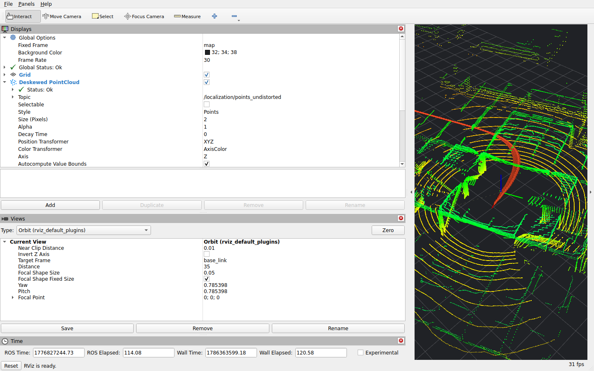

# Autoware Logging Simulation Evaluation

## Conclusion

On 2026-08-10, two private Hesai recordings were replayed end to end with
Autoware 1.9.0 in a localization-interface-only configuration. Both headless
runs and the Course 1 RViz run passed automated output-bag validation.

The evaluation verifies compatibility with Autoware localization topics, TF,
simulation time, and GNSS-outage recovery. It does not launch a PCD/Lanelet2
map, perception, planning, or control. It therefore does not establish absolute
localization accuracy or closed-loop driving readiness.

The `hesai-rosbag23` Logging Simulation profile did apply the intended
site-local NMEA origin and calibrated static transforms. This differs from the
historical native accuracy runs described in the
[LiDAR/IMU/GNSS evaluation](lidar_imu_gnss.md).

No publishable RViz video exists yet. A curated RViz screenshot is available.

## Test conditions

| Property | Value |
|---|---|
| Date | 2026-08-10 |
| Autoware | 1.9.0 with `autoware_launch` 0.52.0 |
| ROS | Jazzy |
| Execution | CPU-only Docker, localization-interface-only |
| Dataset profile | `hesai-rosbag23` |
| Inputs | Private Course 1 and Course 2 recordings; not distributed on GitHub |
| Localization | LiDAR + IMU + GNSS, `scan_to_scan` |
| Playback | 1.0x with a 100 Hz simulation clock |
| TF | Recorded TF was isolated; the profile published three calibrated static transforms |

`scan_to_scan` is the primary LiDAR-odometer registration source in these runs.
They are integration tests, not scan-to-scan versus isolated scan-to-submap A/B
tests.

## Headless end-to-end results

| Dataset | Analyzed messages | Kinematic states | Effective output rate | Maximum XY step | Automated validation |
|---|---:|---:|---:|---:|---|
| Hesai 32-Line + IMU + RTK GNSS — Course 1 | 198,636 | 10,175 | 52.236 Hz | 0.400703 m | Pass: 35 pass, 0 fail, 1 warning |
| Hesai 32-Line + IMU + RTK GNSS — Course 2 | 202,984 | 10,720 | 54.334 Hz | 0.521073 m | Pass: 34 pass, 0 fail, 2 warnings |

Both runs passed finite-pose, covariance, `map -> base_link` TF, monotonic
timestamp, final-time coverage, and adapter-consistency checks.

| Check | Hesai 32-Line + IMU + RTK GNSS — Course 1 | Hesai 32-Line + IMU + RTK GNSS — Course 2 |
|---|---:|---:|
| Successful deskew | 4,214 / 4,215 (99.976%) | 4,272 / 4,273 (99.977%) |
| Accepted LiDAR registration | 4,188 / 4,213 (99.407%) | 4,251 / 4,271 (99.532%) |
| Tracking resets | 0 | 0 |
| Adapter rejects | 0 | 0 |
| Final GNSS fusion | `tracking / full_se2` | `tracking / full_se2` |

Course 2 passed two GNSS occlusions and returned through
`OUTAGE -> REACQUIRING -> RECOVERING -> TRACKING` after an approximately
63-second outage. Its maximum 0.521073-m step remained within the 0.55-m gate
but was retained as a warning.

The effective output rates demonstrate real-time completion for these runs.
They are not CPU-utilization measurements. CPU utilization and RSS were not
recorded.

[Machine-readable Logging Simulation metrics and provenance](assets/autoware_lsim_hesai_course_1/metrics.json)

## RViz evidence

The Course 1 RViz run also passed automated validation with 35 passes, no
failures, and one warning. `/rviz2` remained alive until completion; RViz showed
`Global Status: Ok` and `Deskewed PointCloud Status: Ok`, and rendered the point
cloud at 31 fps.

[](assets/autoware_lsim_hesai_course_1/rviz.png)

| Property | Value |
|---|---|
| Resolution | 1,440 x 900 px |
| SHA-256 | `bda87685bb96c68558329791f0a5f5b1527ebb996df968b3c77a631477e73cf7` |
| Visible evidence | Deskewed point cloud, kinematic-state trail, `base_link` axes, status panels, and 31 fps |

The RViz run's 98.290-Hz effective output rate must not be compared directly
with the headless values. Software rendering adds load, and the run used a
different locally rebuilt image after an RViz QoS configuration change. The
number only confirms that the visualization run completed in real time; it is
not evidence of a performance or CPU improvement.

## Video publication status

An RViz video has not been recorded. A future public video should be generated
from a fresh passing Course 1 run with a command of this form:

```bash
ROS_DOMAIN_ID=84 ./script/run_autoware_lsim_docker.sh \
  --bag <course_1_bag> \
  --profile hesai-rosbag23 \
  --tracking-mode scan_to_scan \
  --run-name hesai_course_1_lsim_rviz_publication \
  --rviz
```

The recording should:

- capture only the 1,440 x 900 RViz window, not the full desktop;
- use a representative 20-to-40-second interval after both relevant RViz
  statuses become `Ok`;
- show the deskewed cloud, moving kinematic-state trail, and `base_link` axes;
- avoid notifications, personal information, terminals containing secrets, and
  unnecessary audio;
- record duration, resolution, frame rate, codec, file size, SHA-256, repository
  commit, container image, playback rate, ROS time interval, and runner options;
- state explicitly that visualization is functional evidence, not a CPU or
  absolute-accuracy measurement.

The video should be published as an external release asset rather than committed
to Git. Its version-controlled poster and manifest belong under
`docs/evaluation/assets/`.

## Related documentation and implementation

- [Reusable rosbag and Autoware workflow](../rosbag_and_autoware_lsim_evaluation.md)
- [Docker profile](../../docker/autoware_lsim/README.md)
- [Docker runner](../../script/run_autoware_lsim_docker.sh)
- [Autoware Logging Simulation launch](../../src/pure_odometry_bringup/launch/autoware_lsim_localization.launch.py)
- [Hesai RViz configuration](../../src/pure_odometry_bringup/config/autoware_lsim/hesai_rosbag23.rviz)
- [RViz Compose override](../../docker/autoware_lsim/compose.rviz.yaml)
- [Output-bag validator](../../tools/analyze_autoware_lsim_output.py)

