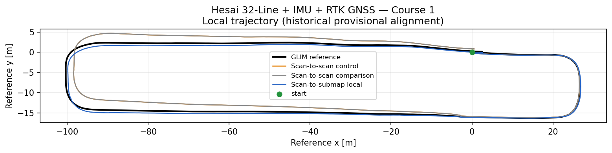

# LiDAR/IMU/GNSS Evaluation

## Status and provenance warning

Historical 1.0x A/B runs measured two courses with a Hesai 32-line LiDAR, IMU,
and RTK GNSS. They kept the existing scan-to-scan/GNSS fusion output unchanged
and added isolated precision-local scan-to-submap and guarded precision-global
outputs. Both runs passed their original runtime and safety gates.

However, those native runs used the base NMEA configuration's Tokyo origin
because the intended site-local origin override was checked but not passed to
the launch. The evaluation configuration and runner now apply the site-local
override, but no corrected-profile rerun has been completed. The accuracy values
on this page are therefore **historical provisional measurements**, not final
acceptance results for the reorganized profile. They must be reproduced before
publication or adoption.

The local odometry values do not directly use the GNSS map origin, but they are
also kept provisional until one corrected-profile run reproduces the complete
A/B result and its non-intrusion checks.

The plots and metrics use
[frozen calibration-window alignment](methodology.md#alignment-b-frozen-calibration-window).
They do not use exact-initial-pose alignment, so their first XY and yaw errors
are not necessarily zero.

## Dataset and output mapping

The source rosbags are private and are not distributed on GitHub. The legacy
artifact identifiers are `PC2` for Course 1 and `PC3` for Course 2; they are
retained only inside provenance metadata.

| Dataset | Duration | Local baseline | Local precision | Global baseline | Global precision |
|---|---:|---|---|---|---|
| Hesai 32-Line + IMU + RTK GNSS — Course 1 | 210.757 s | Raw scan-to-scan from the precision run | Precision-local scan-to-submap | Existing GNSS fusion | Guarded precision-global |
| Hesai 32-Line + IMU + RTK GNSS — Course 2 | 213.635 s | Raw scan-to-scan from the precision run | Precision-local scan-to-submap | Existing GNSS fusion | Guarded precision-global |

The local table evaluates LiDAR/IMU odometry. The global table evaluates
map-frame output after the GNSS anchor is applied. These are separate claims:
scan-to-submap RMSE is not precision-global RMSE.

## Historical local-odometry A/B

Fixed XY and yaw use one frozen control-derived alignment shared by both A/B
streams. Full-shape XY independently fits each trajectory and is included only
as a shape diagnostic.

| Dataset | Output | Fixed XY RMSE | Full-shape XY RMSE | Yaw RMSE | Fixed XY improvement |
|---|---|---:|---:|---:|---:|
| Hesai 32-Line + IMU + RTK GNSS — Course 1 | Scan-to-scan raw | 1.8953 m | 1.3299 m | 1.8908 deg | Baseline |
| Hesai 32-Line + IMU + RTK GNSS — Course 1 | Scan-to-submap precision-local | 0.6473 m | 0.3324 m | 0.7282 deg | 65.85% |
| Hesai 32-Line + IMU + RTK GNSS — Course 2 | Scan-to-scan raw | 1.9880 m | 1.0812 m | 1.9148 deg | Baseline |
| Hesai 32-Line + IMU + RTK GNSS — Course 2 | Scan-to-submap precision-local | 0.5468 m | 0.3261 m | 0.8980 deg | 72.50% |

Historical translation RPE:

| Dataset and output | 10 m | 50 m | 100 m |
|---|---:|---:|---:|
| Hesai 32-Line + IMU + RTK GNSS — Course 1, scan-to-scan | 0.3725 m | 1.4331 m | 2.9387 m |
| Hesai 32-Line + IMU + RTK GNSS — Course 1, scan-to-submap | 0.1822 m | 0.6440 m | 1.3194 m |
| Hesai 32-Line + IMU + RTK GNSS — Course 2, scan-to-scan | 0.2421 m | 0.9496 m | 1.7188 m |
| Hesai 32-Line + IMU + RTK GNSS — Course 2, scan-to-submap | 0.1562 m | 0.5842 m | 0.9941 m |

## Historical global-GNSS A/B

| Dataset | Output | Fixed XY RMSE | Full-shape XY RMSE | Yaw RMSE | Fixed XY improvement |
|---|---|---:|---:|---:|---:|
| Hesai 32-Line + IMU + RTK GNSS — Course 1 | Existing GNSS fusion | 1.2083 m | 1.0864 m | 2.9204 deg | Baseline |
| Hesai 32-Line + IMU + RTK GNSS — Course 1 | Guarded precision-global | 0.3658 m | 0.3141 m | 2.7076 deg | 69.73% |
| Hesai 32-Line + IMU + RTK GNSS — Course 2 | Existing GNSS fusion | 1.7971 m | 0.9356 m | 2.7261 deg | Baseline |
| Hesai 32-Line + IMU + RTK GNSS — Course 2 | Guarded precision-global | 0.7542 m | 0.3161 m | 2.2140 deg | 58.03% |

During the common GNSS outage intervals, historical global XY RMSE changed
from 1.5493 m to 0.4631 m for Course 1 and from 2.2651 m to 0.9441 m for
Course 2. Anchor target and applied values remained serialized-value stable
while strict fusion health was false.

The guarded global initial yaw was enabled only after three candidates became
consistent; precision-global output remained suppressed before that point. The
corrected-profile rerun must repeat this startup, outage, and non-intrusion
validation.

## Curated plots and metrics

Only one representative trajectory is embedded here. Error plots and the other
trajectories remain linked.

Course 1 evidence:

- [Local XY error](assets/hesai_32line_imu_rtk_gnss_course_1/local_xy_error.png)
- [Local yaw error](assets/hesai_32line_imu_rtk_gnss_course_1/local_yaw_error.png)
- [Global trajectory](assets/hesai_32line_imu_rtk_gnss_course_1/global_trajectory.png)
- [Global XY error](assets/hesai_32line_imu_rtk_gnss_course_1/global_xy_error.png)
- [Global yaw error](assets/hesai_32line_imu_rtk_gnss_course_1/global_yaw_error.png)
- [Machine-readable metrics and provenance](assets/hesai_32line_imu_rtk_gnss_course_1/metrics.json)

Course 2 evidence:

- [Local trajectory](assets/hesai_32line_imu_rtk_gnss_course_2/local_trajectory.png)
- [Local XY error](assets/hesai_32line_imu_rtk_gnss_course_2/local_xy_error.png)
- [Local yaw error](assets/hesai_32line_imu_rtk_gnss_course_2/local_yaw_error.png)
- [Global trajectory](assets/hesai_32line_imu_rtk_gnss_course_2/global_trajectory.png)
- [Global XY error](assets/hesai_32line_imu_rtk_gnss_course_2/global_xy_error.png)
- [Global yaw error](assets/hesai_32line_imu_rtk_gnss_course_2/global_yaw_error.png)
- [Machine-readable metrics and provenance](assets/hesai_32line_imu_rtk_gnss_course_2/metrics.json)

## Runtime and unmeasured CPU load

| Dataset | Historical runtime gate | Matcher processing p99 | End-to-end latency p99 | Queue drops | CPU | RSS |
|---|---|---:|---:|---:|---|---|
| Hesai 32-Line + IMU + RTK GNSS — Course 1 | 25/25 pass at 1.0x | 89.441 ms | 171.006 ms | 0 | Not measured | Not measured |
| Hesai 32-Line + IMU + RTK GNSS — Course 2 | 25/25 pass at 1.0x | 53.879 ms | 128.002 ms | 0 | Not measured | Not measured |

Processing and latency values support deadline and queue analysis but are not
CPU utilization. No baseline-versus-precision CPU or RSS samples exist for
these runs, so no CPU improvement or regression is claimed.

## Required corrected-profile rerun

Before these results become final acceptance evidence:

1. run both courses at 1.0x with the intended site-local NMEA-origin override;
2. verify the resolved parameters and record their hashes;
3. repeat local and global A/B metrics with one declared alignment method;
4. repeat guarded startup-yaw, GNSS-outage, accepted-scan non-intrusion, and
   queue-drop gates;
5. collect controlled CPU and RSS samples for baseline and precision modes;
6. replace the provisional metrics and plots only if the corrected run passes.

The two courses share one Hesai sensor configuration. They do not establish
generalization to another LiDAR, rig calibration, environment, weather, or
speed range.

